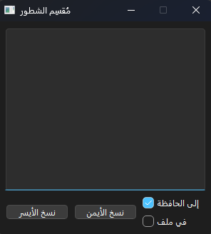

# Poem Splitter
A tiny, PyQt6 desktop tool that lets you paste paired lines (e.g., bilingual verses or Q&A), split them into **left** / **right** sides, optionally **copy** the result or a **tabular** version, and visually **highlight** matched parts or alternating lines.

---

## ✨ Features

- **Two-column parser**: Detects lines with separators and splits into left/right.
  - Supported separators: **2+ spaces**, `.....`, `~~~~`, `----`, `====`
- **Copy outputs**:
  - **Copy Left** or **Copy Right** (one column per line)
  - **Copy as Table** (tab-separated “Right<TAB>Left” for spreadsheets)
- **Highlights**:
  - Auto-highlight matched side within each line
  - Alternate line highlighting (even/odd) when no separator is present
- **Quality of life**:
  - **Copy to Clipboard** checkbox
  - **Log to file** (`OutputFile.txt`) checkbox
  - **Esc** closes the window
- **Windows-friendly look** via `app.setStyle('windows11')` (falls back if not available)

---

## 📦 Requirements

- **Python** 3.9+ (3.11 recommended)
- **PyQt6**
- (Optional) **uv** (fast Python package/venv manager by Astral)

---

## 🚀 Quick Start

### Option A — Using `uv` (recommended)

```bash
# 1) Create project venv and install
uv venv
uv pip install -r requirements.txt  # if you have one
# or:
uv pip install PyQt6

# 2) Run
uv run python main.py
```
# 🗂️ Project Structure
```
.
├─ main.py          # PyQt6 app (window, parsing, highlighting, copy actions)
├─ settings.py      # Strings, dbg() helper, etc.
└─ requirements.txt # Optional: PyQt6
```

# 📄 License

MIT — do whatever you want, just keep the notice.

# 💡 Roadmap

- Export to CSV / Markdown table

- Custom separator configuration (UI)

- Remember last options (checkbox states)

- Per-side preview panes


