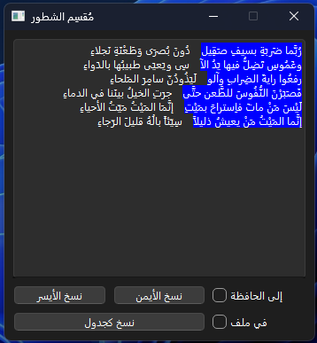

# Poem Splitter
A tiny, PyQt6 desktop tool that lets you paste paired lines split them into **left** / **right** sides, optionally **copy** the result or a **tabular** version, and visually **highlight** matched parts or alternating lines.

---

## ✨ Features

- **Two-column parser**: Detects lines with separators and splits into left/right.
  - Supported separators: **2+ spaces**, `.....`, `~~~~`, `----`, `====`
- **Copy outputs**:
  - **Copy Left** or **Copy Right** (one column per line)
  - **Copy as Table** (tab-separated “Right<TAB>Left” for spreadsheets)
- **Highlights**:
  - Auto-highlight matched side within each line
  - Alternate line highlighting (even/odd) when no separator is present
- **Quality of life**:
  - **Copy to Clipboard** checkbox
  - **Log to file** (`OutputFile.txt`) checkbox
  - **Esc** closes the window
- **Windows-friendly look** via `app.setStyle('windows11')` (falls back if not available)


```bash
uv run python main.py
```
